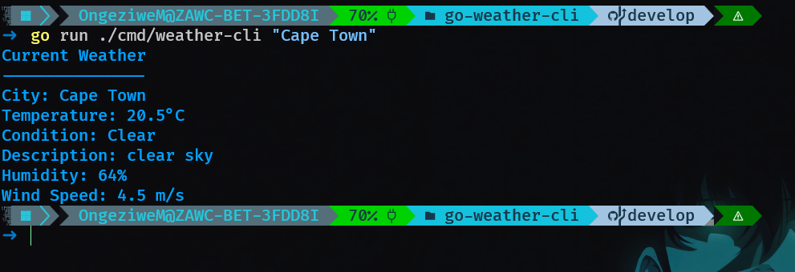

# Go Weather CLI

## Description

A simple command-line weather application written in Go that fetches current weather information for a city.

## Features

- Search weather by city
- View temperature
- View weather condition
- View humidity
- View wind speed

## Requirements

- Go installed
- Internet connection
- OpenWeather API key

## How to Run

go run ./cmd/weather-cli "Cape Town"

## Example Output

Current Weather
---------------
City: Cape Town
Temperature: 20.5°C
Condition: Clear
Description: clear sky
Humidity: 64%
Wind Speed: 4.5 m/s

## Screenshots

## (NB) Environment Variables

Create a `.env` file in the project root:
OPENWEATHER_API_KEY=your_api_key_here
